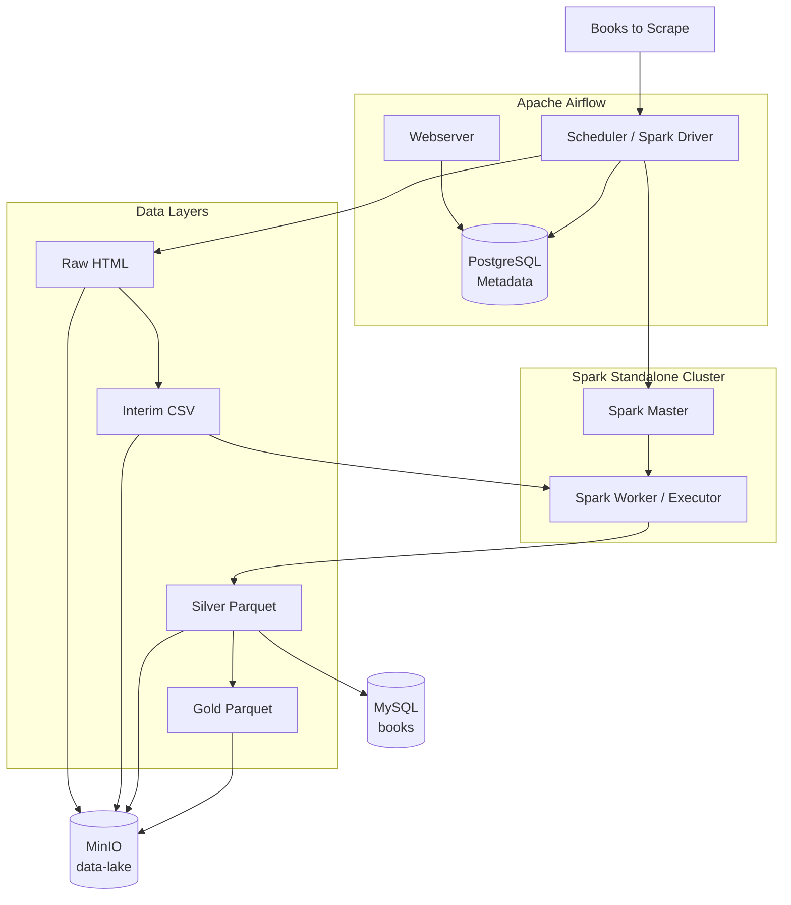
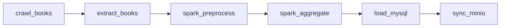

<div align="center">

# Airflow–Spark Data Collection Pipeline

### Airflow로 웹 크롤링을 오케스트레이션하고 Spark로 데이터를 처리하는 데이터 파이프라인

<br>


<br>


<br><br>

# Airflow–Spark Data Collection Pipeline

> Airflow로 정적 웹 크롤링을 오케스트레이션하고 Spark로 데이터를 정제·집계한 뒤 MySQL과 MinIO에 저장하는 Docker 기반 엔드투엔드 데이터 파이프라인

이 프로젝트는 [Books to Scrape](https://books.toscrape.com/)의 도서 데이터를 배치 단위로 수집합니다. Apache Airflow가 전체 실행 순서와 상태를 관리하고, Apache Spark Standalone Cluster가 전처리와 통계 집계를 수행합니다. 처리 결과는 Raw–Interim–Silver–Gold 계층으로 관리하며, 정제된 상세 데이터는 MySQL에 Upsert하고 계층별 파일은 MinIO Object Storage에 동기화합니다.

</div>

<br>

---

## 핵심 학습 목표

- DAG 기반 워크플로 오케스트레이션과 태스크 의존성 관리
- Spark Driver–Master–Worker 구조의 분산 처리
- `batch_id`를 이용한 실행 결과와 데이터 계보 추적
- Medallion Architecture를 응용한 계층별 데이터 관리
- 관계형 DB와 Object Storage의 목적별 분리
- 기본키 기반 Upsert를 통한 재실행 안정성 확보
- Docker Compose 기반 다중 컨테이너 실행 환경 구성
- 컨테이너 UID 일치를 통한 공유 볼륨 권한 관리

---

## 1. 기술 스택

| 영역 | 기술 | 적용 목적 |
|---|---|---|
| 오케스트레이션 | Apache Airflow 2.10.5 | DAG 실행, 의존성, 재시도, 로그 및 상태 관리 |
| 분산 처리 | Apache Spark 3.5.3 / PySpark | 전처리, 중복 제거, Parquet 변환, 통계 집계 |
| 메타데이터 DB | PostgreSQL 16 | Airflow 사용자, DAG Run, Task 상태 저장 |
| 서비스 DB | MySQL 8.4 | 정제된 도서 상세 데이터 저장과 조회 |
| Object Storage | MinIO | Raw–Gold 파일을 S3 호환 방식으로 보관 |
| 수집·파싱 | Requests / BeautifulSoup4 | 정적 HTML 수집과 도서 정보 추출 |
| 데이터 연계 | Pandas / PyArrow / SQLAlchemy | Parquet 읽기, 레코드 변환, MySQL 적재 |
| 실행 환경 | Docker Desktop / Docker Compose | 격리되고 재현 가능한 로컬 환경 구성 |
| 품질 관리 | pytest / Ruff | 단위 테스트 및 정적 코드 검사 |

---

## 2. 시스템 아키텍처



### PostgreSQL과 MySQL을 분리한 이유

- `airflow-postgres`는 DAG Run, Task Instance, 사용자 등 Airflow 운영 메타데이터를 저장합니다.
- `mysql`은 파이프라인이 생성한 정제 도서 데이터를 `books` 테이블에 저장합니다.

운영 메타데이터와 서비스 데이터를 분리하면 책임, 장애 범위, 백업 대상을 명확히 구분할 수 있습니다.

---

## 3. DAG 처리 흐름

DAG ID는 `books_airflow_spark_pipeline`이며 `schedule=None`입니다. Airflow UI에서 수동 Trigger하여 전체 흐름을 확인하도록 구성했습니다.



| 순서 | Task | 실행 주체 | 주요 처리 | 출력 |
|---:|---|---|---|---|
| 1 | `crawl_books` | PythonOperator | 페이지별 HTML 요청과 원본 보존 | Raw HTML |
| 2 | `extract_books` | PythonOperator | BeautifulSoup 파싱과 구조화 | Interim CSV |
| 3 | `spark_preprocess` | SparkSubmitOperator | 자료형 변환, 정제, 결측·중복 제거 | Silver Parquet |
| 4 | `spark_aggregate` | SparkSubmitOperator | 평점별 건수와 가격 통계 계산 | Gold Parquet |
| 5 | `load_mysql` | PythonOperator | Silver 데이터를 `books`에 Upsert | MySQL |
| 6 | `sync_minio` | PythonOperator | 한 배치의 네 계층 파일 업로드 | MinIO |

기본 재시도 횟수는 2회이고 재시도 간격은 1분입니다. `max_active_runs=1`로 동일 DAG의 배치가 동시에 출력 경로를 변경하지 않도록 제한합니다.

---

## 4. batch_id와 데이터 계보

Airflow DAG Run의 논리 실행 시각을 서울 시간 `YYYYMMDD_HHmmss`로 변환하여 `batch_id`를 생성합니다.

```text
예: 20260907_001500
```

`batch_id`는 XCom으로 후속 태스크에 전달되며, 한 DAG Run의 모든 결과를 연결합니다.

```text
data/raw/html/20260907_001500/
data/interim/20260907_001500/
data/silver/20260907_001500/
data/gold/20260907_001500/
```

이를 통해 원본과 정제 결과의 관계, 실패 지점, MySQL 레코드 갱신 배치를 추적할 수 있습니다.

---

## 5. 데이터 레이어

| 계층 | 형식 | 의미 | 활용 |
|---|---|---|---|
| Raw | HTML | 변경하지 않은 수집 원본 | 재파싱, 장애 복구, 수집 증적 |
| Interim | CSV | HTML에서 필드를 추출한 중간 데이터 | 파싱 검토, Spark 입력 |
| Silver | Parquet | 자료형과 품질 규칙을 적용한 상세 데이터 | 분석, DB 적재, 재사용 |
| Gold | Parquet | 분석 목적에 맞게 집계한 데이터 | 통계, 리포트, 대시보드 |

Silver 주요 컬럼:

| 컬럼 | 자료형 | 설명 |
|---|---|---|
| `book_id` | string | URL 상품 번호 또는 대체 해시 기반 식별자 |
| `title` | string | 공백을 정규화한 도서명 |
| `price` | decimal(10,2) | 숫자형 가격 |
| `rating` | integer | 별점 |
| `in_stock` | boolean | 재고 여부 |
| `page` | integer | 수집 페이지 번호 |
| `batch_id` | string | DAG Run 배치 식별자 |
| `source_site` | string | 데이터 출처 |
| `detail_url` | string | 도서 상세 URL |

Gold는 `rating`별 `book_count`, `avg_price`, `min_price`, `max_price`를 계산합니다.

Spark는 Parquet을 디렉터리 단위로 저장하므로 다음 구조가 정상입니다.

```text
data/silver/{batch_id}/
├── part-00000-....snappy.parquet
└── _SUCCESS
```

`_SUCCESS`는 Spark 출력 작업이 정상 완료되었음을 나타냅니다.

---

## 6. Spark 분산 처리 구조

`SparkSubmitOperator`는 `spark://spark-master:7077`로 Application을 제출합니다. `deploy_mode=client`이므로 Spark Driver는 `airflow-scheduler` 컨테이너에서 실행되고 실제 Task는 `spark-worker`의 Executor가 처리합니다.

```text
Airflow Scheduler
└─ spark-submit / Spark Driver
   ├─ Spark Master에 Application 등록
   └─ Spark Worker Executor에 Task 할당
```

Driver–Executor 통신을 위한 주요 설정:

```text
spark.driver.host        = airflow-scheduler
spark.driver.bindAddress = 0.0.0.0
spark.driver.port        = 37777
spark.blockManager.port  = 37778
spark.executor.instances = 1
spark.executor.cores     = 1
spark.executor.memory    = 1g
```

현재 데이터량은 작지만 분산 처리 구조와 운영 흐름 학습을 위해 Spark를 적용했습니다. 수집 범위와 Worker 수를 늘리면 같은 구조를 더 큰 배치로 확장할 수 있습니다.

---

## 7. 공유 볼륨과 UID 설계

Airflow Scheduler와 Spark Worker는 `./data:/opt/project/data`를 함께 사용합니다. Driver가 배치 디렉터리를 만들고 Worker가 그 안에 `_temporary`와 Parquet 파일을 생성하므로 사용자 UID가 다르면 다음 오류가 발생할 수 있습니다.

```text
java.io.IOException: Mkdirs failed to create
file:/opt/project/data/silver/{batch_id}/_temporary/...
```

`Dockerfile.spark`에서 Spark 사용자를 `/etc/passwd`에 유지하면서 UID/GID를 Airflow와 같은 `50000:0`으로 맞춥니다.

```text
airflow-scheduler: uid=50000(airflow), gid=0(root)
spark-master:      uid=50000(spark),   gid=0(root)
spark-worker:      uid=50000(spark),   gid=0(root)
```

Compose에서 숫자 UID만 강제하면 해당 UID의 사용자 이름을 찾지 못해 Hadoop 로그인 과정에서 `invalid null input: name`이 발생할 수 있습니다. 따라서 커스텀 Spark 이미지에서 실제 `spark` 사용자의 UID를 변경합니다.

Spark Master와 Worker는 같은 이미지를 사용합니다. 동일 태그를 두 서비스가 병렬로 빌드하면 `image already exists` 충돌이 생길 수 있으므로 `build`는 Spark Master에만 선언하고 Worker는 완성된 이미지를 참조합니다.

---

## 8. MySQL Upsert와 재실행 안정성

Silver 데이터는 `books` 테이블에 저장됩니다. `book_id`가 기본키이며 `INSERT ... ON DUPLICATE KEY UPDATE`를 사용합니다. 같은 페이지를 다시 수집해도 동일 도서가 중복 행으로 계속 증가하지 않고 최신 배치 값으로 갱신됩니다.

`book_id` 규칙:

1. 상세 URL에서 상품 번호를 추출할 수 있으면 해당 번호 사용
2. 상품 번호가 없으면 `title + source_site`의 SHA-256 해시 사용

주요 인덱스는 `batch_id`와 `rating`에 설정되어 배치 및 평점 기준 조회를 지원합니다.

---

## 9. Docker Compose 서비스

| 서비스 | 역할 | 호스트 포트 |
|---|---|---:|
| `airflow-postgres` | Airflow 메타데이터 DB | 미공개 |
| `airflow-init` | DB migration, 관리자·Spark Connection 생성 | 일회성 |
| `airflow-webserver` | Airflow UI | `8080` |
| `airflow-scheduler` | DAG 실행, Python Task, Spark Driver | 필요 시 `4040` |
| `spark-master` | Spark Standalone Master | UI `8081`, Cluster `7077` |
| `spark-worker` | Spark Executor | UI `8082` |
| `mysql` | 도서 상세 데이터 저장 | `3307 → 3306` |
| `minio` | S3 호환 Object Storage | API `9000`, Console `9001` |
| `minio-init` | `data-lake` 버킷 생성 | 일회성 |

컨테이너는 `pipeline-network`에서 서비스 이름으로 통신합니다. 컨테이너 내부 MySQL 주소는 `mysql:3306`, MinIO 주소는 `minio:9000`입니다.

---

## 10. 프로젝트 구조

```text
airflow-spark-data-collection-pipeline/
├── airflow/
│   ├── dags/books_pipeline_dag.py
│   └── logs/.gitkeep
├── data/
│   ├── raw/html/.gitkeep
│   ├── interim/.gitkeep
│   ├── silver/.gitkeep
│   └── gold/.gitkeep
├── docker/airflow/Dockerfile
├── spark/
│   ├── preprocess_books.py
│   └── aggregate_books.py
├── src/data_collection_pipeline/
│   ├── config.py
│   ├── crawling.py
│   ├── extract.py
│   ├── helpers.py
│   ├── database.py
│   ├── load.py
│   └── minio_storage.py
├── tests/
│   ├── test_crawling.py
│   ├── test_extract.py
│   ├── test_helpers.py
│   └── test_load.py
├── .env.example
├── .gitignore
├── Dockerfile.spark
├── docker-compose.yml
├── pyproject.toml
├── requirements.txt
└── requirements-dev.txt
```

---

## 11. 사전 준비와 환경변수

필수 프로그램은 Docker Desktop, Git, Git Bash입니다. VS Code와 MySQL Workbench는 선택 사항입니다. 여러 컨테이너와 JVM을 함께 실행하므로 Docker Desktop에 최소 6 GB 이상의 메모리를 권장합니다.

```bash
cp .env.example .env
```

기본 설정:

```dotenv
AIRFLOW_UID=50000
AIRFLOW_ADMIN_USER=airflow
AIRFLOW_ADMIN_PASSWORD=airflow
MYSQL_DATABASE=booksdb
MYSQL_USER=books
MYSQL_PASSWORD=books
MYSQL_ROOT_PASSWORD=root
MINIO_ROOT_USER=minioadmin
MINIO_ROOT_PASSWORD=minioadmin
MINIO_BUCKET=data-lake
START_PAGE=1
END_PAGE=3
```

`.env`는 Git에 커밋하지 않고 `.env.example`만 설정 예시로 공유합니다. 운영 환경에서는 기본 비밀번호를 사용하지 않아야 합니다.

---

## 12. 최초 실행

Compose 문법 확인:

```bash
docker compose config --quiet
```

이미지 빌드:

```bash
docker compose build --no-cache
```

Spark 이미지만 다시 빌드할 때는 한 번만 빌드합니다.

```bash
docker compose build --no-cache spark-master
```

Airflow 초기화와 전체 서비스 실행:

```bash
docker compose up airflow-init
docker compose up -d
docker compose ps
```

`airflow-init`와 `minio-init`은 일회성 서비스이므로 작업 후 `exited (0)`이어도 정상입니다. 나머지 서비스는 `running` 또는 `healthy`여야 합니다.

---

## 13. 접속 정보

| 서비스 | URL 또는 접속 정보 | 기본 계정 |
|---|---|---|
| Airflow | <http://localhost:8080> | `airflow / airflow` |
| Spark Master UI | <http://localhost:8081> | 없음 |
| Spark Worker UI | <http://localhost:8082> | 없음 |
| MinIO Console | <http://localhost:9001> | `minioadmin / minioadmin` |
| MySQL Workbench | `localhost:3307`, DB `booksdb` | `books / books` |

MySQL Workbench가 MySQL 8.4에 호환성 경고를 표시해도 연결 테스트가 성공하면 `Continue Anyway`로 접속할 수 있습니다.

---

## 14. DAG 실행과 모니터링

1. Airflow에 로그인합니다.
2. `books_airflow_spark_pipeline`을 찾습니다.
3. DAG 토글을 활성화합니다.
4. 실행 버튼에서 `Trigger DAG`를 선택합니다.
5. `Graph`, `Details`, `Logs`, `Event Log`에서 상태를 확인합니다.

Airflow 버전에 따라 메뉴 구성이 다를 수 있습니다. 최종 성공 기준은 하나의 DAG Run에서 태스크 6개가 모두 초록색 `success` 상태가 되는 것입니다.

DAG import 오류 확인:

```bash
docker compose exec airflow-scheduler airflow dags list-import-errors
```

---

## 15. 결과 검증

로컬 데이터:

```bash
find ./data -maxdepth 4 -type f | sort
```

```text
data/raw/html/{batch_id}/books_page_001.html
data/interim/{batch_id}/books_page_001_parsed.csv
data/silver/{batch_id}/part-*.snappy.parquet
data/silver/{batch_id}/_SUCCESS
data/gold/{batch_id}/part-*.snappy.parquet
data/gold/{batch_id}/_SUCCESS
```

MySQL 검증:

```sql
USE booksdb;

SELECT COUNT(*) AS stored_book_count FROM books;

SELECT *
FROM books
ORDER BY page, title
LIMIT 20;

SELECT book_id, COUNT(*) AS duplicate_count
FROM books
GROUP BY book_id
HAVING COUNT(*) > 1;
```

마지막 쿼리 결과가 없으면 `book_id` 기준 중복이 없습니다.

MinIO에서는 `data-lake` 버킷의 다음 구조를 확인합니다.

```text
raw/{batch_id}/...
interim/{batch_id}/...
silver/{batch_id}/...
gold/{batch_id}/...
```

Spark Master UI에서는 Worker가 `ALIVE`인지 확인합니다. 작은 Job은 빠르게 끝나므로 `Completed Applications`도 확인합니다.

---

## 16. 재실행 검증

기존 Task를 Clear하지 않고 새 DAG Run을 Trigger하여 다음을 확인합니다.

1. 수동 `chmod` 없이 새 배치 폴더가 생성됨
2. Spark 전처리와 집계가 성공함
3. Silver와 Gold에 `_SUCCESS`가 생성됨
4. MySQL에 동일 도서의 중복 행이 증가하지 않음
5. 새 배치의 네 계층이 MinIO에 업로드됨

UID 확인:

```bash
MSYS_NO_PATHCONV=1 docker compose exec airflow-scheduler id
MSYS_NO_PATHCONV=1 docker compose exec spark-master id
MSYS_NO_PATHCONV=1 docker compose exec spark-worker id
```

세 컨테이너의 UID가 모두 `50000`이면 공유 볼륨 사용자 구성이 일치합니다.

---

## 17. 테스트와 코드 품질

```bash
docker compose exec airflow-scheduler pytest /opt/project/tests -v

docker compose exec airflow-scheduler \
  pytest /opt/project/tests \
  --cov=/opt/project/src/data_collection_pipeline \
  --cov-report=term-missing

docker compose exec airflow-scheduler \
  ruff check /opt/project/src /opt/project/spark /opt/project/tests
```

---

## 18. 운영 명령

```bash
# 상태 확인
docker compose ps

# 로그 확인
docker compose logs airflow-scheduler
docker compose logs spark-master
docker compose logs spark-worker

# 실시간 로그 추적
docker compose logs -f spark-worker

# 중지와 재시작
docker compose stop
docker compose start

# 컨테이너 제거, 데이터 볼륨 유지
docker compose down

# Named Volume까지 완전 삭제
docker compose down -v
```

`docker compose logs -f`는 `Ctrl+C`로 종료해도 컨테이너가 중지되지 않습니다. `down -v`는 PostgreSQL, MySQL, MinIO 데이터를 삭제하지만 bind mount인 호스트 `./data`는 남습니다.

---

## 19. 주요 문제 해결

### `invalid null input: name`

Spark 프로세스에 숫자 UID만 지정하고 `/etc/passwd`에 해당 사용자가 없을 때 발생할 수 있습니다. 커스텀 이미지를 다시 빌드합니다.

```bash
docker compose build --no-cache spark-master
docker compose up -d --force-recreate spark-master spark-worker
```

### `Mkdirs failed to create .../_temporary`

Airflow Driver와 Spark Worker의 UID가 다른 경우입니다. 세 컨테이너의 UID가 `50000`인지 확인하고 실제 `{batch_id}` 폴더의 쓰기 권한을 검사합니다.

### 빌드 중 `image already exists`

동일 Spark 이미지 태그를 Master와 Worker가 동시에 export한 경우입니다.

```bash
docker compose build --no-cache spark-master
```

### Git Bash 경로가 `C:/Program Files/Git/...`로 바뀜

```bash
MSYS_NO_PATHCONV=1 docker compose exec airflow-scheduler \
  ls -la /opt/project/spark
```

### DAG가 표시되지 않음

```bash
docker compose exec airflow-scheduler airflow dags list-import-errors
docker compose logs airflow-scheduler
```

---

## 20. Git 관리 원칙

Git에는 소스, DAG, Dockerfile, Compose, 테스트와 문서를 저장합니다. 실행 로그, `.env`, Raw–Gold 배치 파일은 저장하지 않습니다.

```text
Git 추적: src/, spark/, airflow/dags/, tests/, Dockerfile*, docker-compose.yml
Git 제외: .env, airflow/logs/*, data의 실행 결과, Python 캐시
MinIO 보관: Raw, Interim, Silver, Gold 실행 데이터
```

```bash
git status --short --ignored
git check-ignore -v .env
git check-ignore -v data/silver/<batch_id>/_SUCCESS
```

---

## 21. 향후 확장

| 로컬 구성 | 확장 후보 |
|---|---|
| Docker Airflow | Amazon MWAA 또는 ECS/Fargate |
| Spark Standalone | Amazon EMR / EMR Serverless |
| MinIO | Amazon S3 |
| Docker MySQL | Amazon RDS for MySQL |
| Docker Compose | ECS, EKS 또는 Kubernetes |
| 수동 Trigger | Schedule, Dataset 또는 Event 기반 실행 |

로컬에서 데이터 흐름과 장애 처리를 먼저 검증한 뒤 저장소와 컴퓨팅을 관리형 서비스로 단계적으로 교체할 수 있습니다.

---

## 22. 완료 기준

- [ ] 장기 실행 컨테이너가 정상 상태이다.
- [ ] Spark Master에 Worker가 `ALIVE`로 등록된다.
- [ ] Airflow DAG import 오류가 없다.
- [ ] 새 DAG Run의 태스크 6개가 모두 성공한다.
- [ ] Raw와 Interim에 HTML·CSV가 생성된다.
- [ ] Silver와 Gold에 Parquet과 `_SUCCESS`가 생성된다.
- [ ] MySQL `books` 테이블에 정제 데이터가 적재된다.
- [ ] 재실행 후 `book_id` 중복 행이 생기지 않는다.
- [ ] MinIO에 네 데이터 계층이 동기화된다.
- [ ] pytest와 Ruff 검사가 통과한다.
- [ ] `.env`와 실행 산출물이 Git 추적에서 제외된다.

---

## License

교육 및 학습 목적의 프로젝트입니다. 외부 웹사이트를 수집할 때는 대상 사이트의 이용약관, robots 정책과 요청 빈도 제한을 확인해야 합니다.
